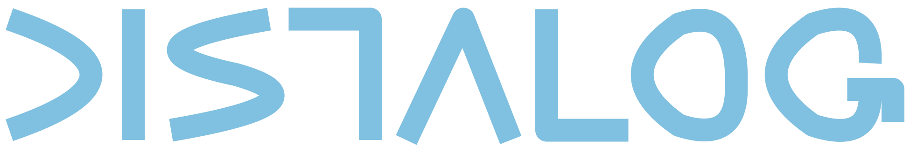

<link rel="stylesheet" href="style.css" />

## Second Level Engineering
DISTALOG LLC, established in [Zürich,
Switzerland](https://en.wikipedia.org/wiki/Z%C3%BCrich), provides
advanced software engineering support and services.

Top-tier software engineers are hard to find and expensive to
hire. The DISTALOG model is to provide advanced engineering know-how
on demand, at the time and place it's most needed. Even if many
companies would rather hire than outsource, we believe that any access
to the level of engineering expertise we provide is better than
none.

Some ways we can help you operate on your project, team or business to
make it more successful:

### Services
#### ÷
Divide  
and conquer your problem space.

The first step of any successful software project is to break it down
into manageable units with well defined relationships and
organizational responsibilities.

- _Requirements gathering_:  
  turn the initial business idea into a detailed set of technically
  usable requirements, leading the discussion between the users or
  sponsor and the technical teams.
- _Architecture:_  
  starting with the requirements, map out the large scale structure of
  the application (its components and their relationships), and
  identify the tools, platforms and frameworks that will best support
  it. Deliver a set of artefacts documenting the results for the
  project team.
- _Organization:_  
  find the right organizational structure for a project, that
  optimally balances control and freedom, for predictability,
  creativity and efficiency.
- _Containerization:_  
  [Containers](https://en.wikipedia.org/wiki/OS-level_virtualization)
  are at the core of modern application management. Decomposing an
  existing or new application into a set of containers allows the use
  of application management environments like
  [Kubernetes](https://kubernetes.io). Identify the set of required
  containers, set up the infrastructure to build them easily and
  continuously.

#### ×
Multiply  
your team's efficiency.

Efficient development processes, tools and teams are key to
agility. We can help setting up or optimizing the tools and training
your team. Here are some the tools we recommend and support:

- _Build Process:_  
  The software build process turns source code, data and media into
  ready to deploy artifacts. It can be time and resource consuming for
  large projects and subject to compliance and security constraints
  like reproductibility. We recommend [Bazel](https://bazel.build/) as
  an industrial-strength build environment and have years of
  experience with the internal Google version of it.
- _Source Control:_  
  [Git](https://git-scm.com/) is becoming a de facto industry standard
  for source code control in projects of all sizes. Getting it right
  lets teams reach the optimal balance between agility in development
  and predictable, timely releases.
-  _Operations_: _  
  [Kubernetes](https://kubernetes.io) is transforming the way
  computing infrastructure is managed across the industry. It can make
  your application easy to manage with a minimum of human effort, and
  portable across on-premises and multiple cloud providers. Do not
  waste precious engineering time on routine operational duties !
- _..._:  
  There are many more specialized tools we are familiar with, please reach out for more details.

#### \-
Subtract  
issues from your roadmap.
    
Meeting unexpected or difficult challenges ? 
We can help overcome, with decades of experience in the industry.

- _Scalability Issues:_  
  Reliable and cost-efficient scaling is key to growing your user
  base. Getting it wrong results in expensive, slow and unreliable service.
  We can get you past the initial small user base through to true web scale.
- _Technical Issues:_  
  Debugging and fixing difficult technical issues is one of our
  specialties. This is where bringing in experienced second-level
  support really shines. You only pay for actual results.
- _Compliance Issues:_  
  Today's regulatory environment imposes an ever-growing number of
  constraints onto service owners. We can help you identify and tackle
  them through appropriate technical measures and tools.
- _Due Diligence, Technical And Security Audits_:  
  Considering investing in or acquiring a company ? We can provide you
  with a detailed technical audit that will make sure you are putting
  your money in the right place. We can also audit your current system
  for potential technical or security issues. We identify potential
  issues before you become responsible for them.

#### \+
Add  
top-tier competence to your project.

Need battle-tested software development or process optimization
know-how ? We can provide !

 - _Custom Development:_  
  We master the full software development cycle and can execute on any
  idea or requirements. We pick the most appropriate programming
  environment, tools and runtime platform for your needs and turn your
  idea into reality !
 - _Outsourcing Consulting:_  
  Considering outsourcing development or operations to an external
  provider ? We can help you pick the right one, acting as hired
  experts on your behalf to thoroughly evaluate the available
  providers before you commit to any of them.
 - _Hiring Consulting:_  
  With more than a decade of experience interviewing candidates for
  technical positions (more than 250 interviews for Google), we can
  help you separate the wheat from the chaff.
  
### Contact
[Email us](mailto:info@distalog.ch?subject=Web+Site) so we can figure
out success together !
